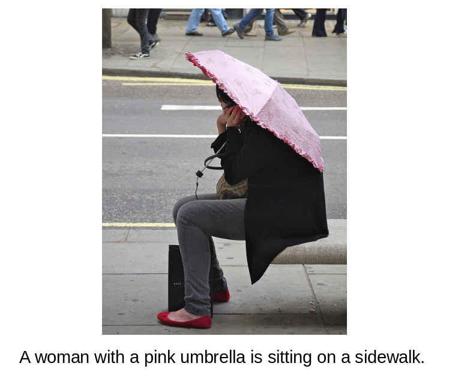
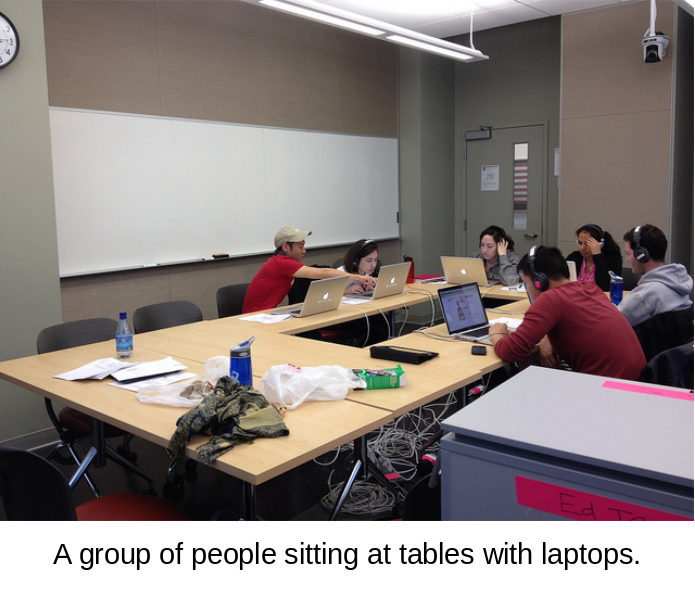
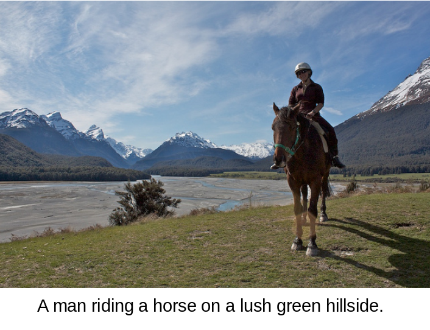

**CA⫶TR**: Image Captioning with Transformers
========
PyTorch training code and pretrained models for **CATR** (**CA**ption **TR**ansformer).

The models are also available via torch hub,
to load model with pretrained weights simply do:
```python
model = torch.hub.load('saahiluppal/catr', 'catr_resnet101', pretrained=True)
```
### Samples:

<p align="center">
  
  
  
  
  
</p>

Test with your own bunch of images:
````bash
$ python predict.py --path /path/to/image
````

# Usage 
There are no extra compiled components in CATR and package dependencies are minimal,
so the code is very simple to use. We provide instructions how to install dependencies.
First, clone the repository locally:
```
git clone https://github.com/saahiluppal/catr.git
```
Then, install PyTorch 1.5+ and torchvision 0.6+ along with remaining dependencies:
```
$ pip install -r requirements.txt
```
That's it, should be good to train and test caption models.

## Data preparation

Download and extract COCO 2017 train and val images with annotations from
[http://cocodataset.org](http://cocodataset.org/#download).
We expect the directory structure to be the following:
```
path/to/coco/
  annotations/  # annotation json files
  train2017/    # train images
  val2017/      # val images
```

## Training
Tweak the hyperparameters from <a href='https://github.com/saahiluppal/catr/blob/master/configuration.py'>configuration</a> file.

To train baseline CATR on a single GPU for 30 epochs run:
```
$ python main.py
```
We train CATR with AdamW setting learning rate in the transformer to 1e-4 and 1e-5 in the backbone.
Horizontal flips, scales an crops are used for augmentation.
Images are rescaled to have max size 299.
The transformer is trained with dropout of 0.1, and the whole model is trained with grad clip of 0.1.

## Testing
To test CATR with your own images.
```
$ python predict.py --path /path/to/image
```

# License
CATR is released under the Apache 2.0 license. Please see the [LICENSE](LICENSE) file for more information.
